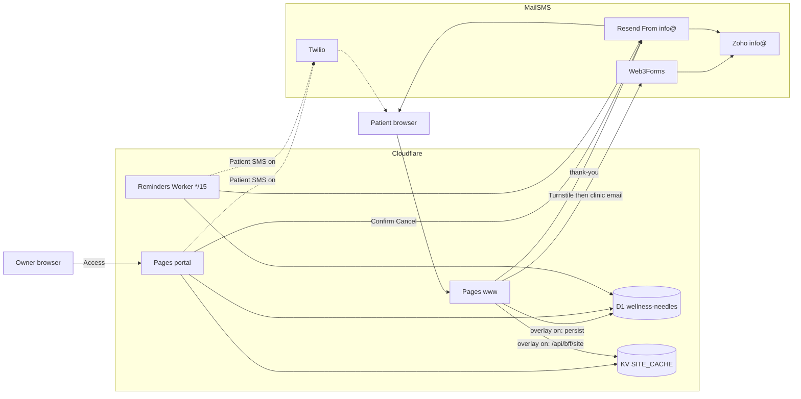
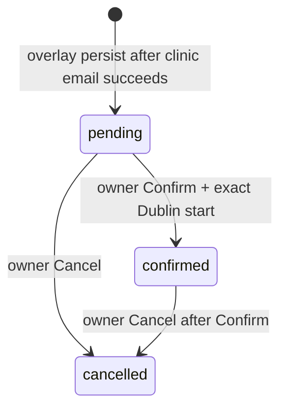
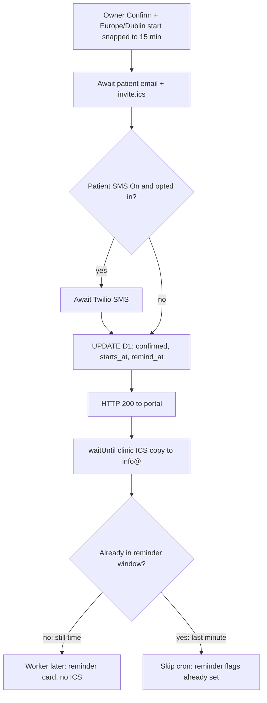

# Architecture

System shape for the public site, owner portal, and website-form bookings. Clinic-owner wording: [OWNER-BOOKINGS.md](OWNER-BOOKINGS.md). Portal operations: [PORTAL.md](PORTAL.md).

## Runtimes

| Piece | Where | Role |
|-------|--------|------|
| www | Cloudflare Pages `wellness-needles` → `www.wellnessneedles.ie` | Static Next export + booking/thank-you Functions. Public BFF only when the overlay kill switch is `"true"`. |
| Portal | Cloudflare Pages `wellness-needles-portal` → `portal.wellnessneedles.ie` | Owner UI behind Access. `/api/admin` lives **only** here. Confirm, Cancel, Publish overlay, Patient SMS switch. |
| Reminders | Worker `wellness-needles-reminders` cron `*/15` | Day-before reminder email (and SMS if enabled). No ICS. |
| D1 `wellness-needles` | EU, binding `DB` | Bookings, reviews, site draft/published JSON, publish history. Bound on **www, portal, and Worker**. |
| KV `SITE_CACHE` | Binding `SITE_CACHE` | Published site snapshot for www overlay. Portal writes; www reads. Not required on the Worker. |
| Resend | Secret `RESEND_API_KEY` on www, portal, Worker | From `Wellness Needles <info@wellnessneedles.ie>`. Thank-you, confirm, combined, reminder, cancel. |
| Web3Forms | Browser after Turnstile | Clinic copy of the **request** to `info@`. Not the confirmed slot. |
| Twilio | Portal + Worker only | Optional patient SMS. Never on www. |

Do not put Access on www. Do not put `/api/admin` on www. Do not put Twilio on www. Do not change apex, www, or Zoho MX.

Mermaid source: [architecture-system.mmd](architecture-system.mmd).

## Overlay

www stays on baked `contact-config.ts` until **both** are true:

1. Production Release sets `NEXT_PUBLIC_SITE_OVERLAY_ENABLED=true`.
2. Settings → **Public website overlay** is Published.

Then www fetches `/api/bff/site` (KV). Fetch/parse failure falls back to baked content. Overlay off: Turnstile + Web3Forms + thank-you still run; **no** D1 persist; **no** Appointments card.

Patient SMS is a separate Published switch (default off).

## Booking lifecycle

Only the **website booking form** enters D1. Phone, Calendly, and Fresha do not.

| Status | Inbox | Mail |
|--------|--------|------|
| `pending` | Appointments list | Thank-you already sent at submit. Confirm or Cancel next. |
| `confirmed` | Leaves pending list | Patient card + `invite.ics`. Day-before reminder unless Confirm was already in the reminder window. |
| `cancelled` | Leaves pending list | Pending: could not confirm (no ICS). Confirmed: cancel notice + `METHOD:CANCEL`. |

`starts_at` is UTC ISO for the exact Europe/Dublin slot. `remind_at` is 09:00 Europe/Dublin on the **calendar day before** `starts_at`. Combined Confirm (already `remind_at <= now`) sets reminder sent flags so the Worker does not send again.

Duration on the ICS block (no schema column): Initial **75**, follow-up or package **45**, else **60**.

## Confirm pipeline

Critical path is **patient first, then D1, then clinic copy in the background**. A slow `info@` send must not leave the row pending after the patient was emailed.

Mermaid source: [architecture-confirm-pipeline.mmd](architecture-confirm-pipeline.mmd). Numbered sequence: [booking-sequence-confirm.mmd](booking-sequence-confirm.mmd).

Portal picker, Confirm click, and `POST /api/admin/bookings/:id` all snap `YYYY-MM-DDTHH:mm` to `:00 / :15 / :30 / :45` (`shared/quarter-hour.ts`). `23:53` becomes the **next calendar day** `00:00`.

Cancel uses the same order: patient mail → D1 `cancelled` → `waitUntil` clinic CANCEL copy when the row was already confirmed.

## Email and calendar

| Event | HTML | ICS | Clinic |
|-------|------|-----|--------|
| Submit thank-you | Request received (www `/api/booking-thank-you`) | None | Request already arrived via Web3Forms |
| Confirm (still before day-before 09:00) | Card, heading **Appointment confirmed** | `METHOD:REQUEST` UID `{bookingId}@wellnessneedles.ie` | Cc + `waitUntil` copy, same UID |
| Combined (day-before after 09:00, or same day) | Card, heading **See you then** | Same REQUEST | Same |
| Reminder (Worker) | Card, heading **See you tomorrow** | **None** | None |
| Cancel pending | Plain notice | None | None |
| Cancel confirmed | Plain notice | `METHOD:CANCEL` same UID | `waitUntil` copy |

Card layout (confirm / combined / reminder): greeting `Hi {first name}, we look forward to seeing you.` Date, Time, Location rows. **Add to Calendar** (Google template) + **Get Directions** on one row, **Call Wellness Needles** below. Footer on confirm/combined: calendar invite attached for Apple/Outlook.

ICS attach failure retries the patient email without the file. If that retry runs, Cc on the patient mail may be omitted; the clinic still gets the dedicated `waitUntil` copy when patient mail succeeded.

Zoho: Calendar on for `info@`. The first invite often needs **Add**. From `info@` Cc `info@` can be dropped as self-mail; that is why the second Resend exists.

Rows confirmed **before** ICS shipped have no prior REQUEST. Later Cancel still sends CANCEL with today’s UID — it will not match an old calendar event.

Not built: same-day reminder, reschedule (`SEQUENCE` is 0 on REQUEST and 1 on CANCEL only).

## Shared code

| Module | Used by | Purpose |
|--------|---------|---------|
| `functions/_lib/email-brand.ts` | www thank-you, portal/Worker notify | Colours, rows, pills, maps, location parse (Celbridge street `56 The Orchard, Oldtown Mill`) |
| `functions/_lib/notify.ts` | Portal Confirm/Cancel, reminder Worker | Card copy, ICS, Resend, Twilio, Dublin `remind_at` |
| `shared/quarter-hour.ts` | Portal UI, Confirm API (re-exported from notify) | 15-minute snap |
| `shared/site-snapshot.ts` | www overlay, portal Settings | Published clinic JSON |

Unit tests: `npm run test:unit`.

## Process flows

| Audience | Doc | Diagrams |
|----------|-----|----------|
| Clinic owner | [OWNER-BOOKINGS.md](OWNER-BOOKINGS.md) | Owner flowchart + [owner-booking-process.mmd](owner-booking-process.mmd) |
| Technical request | [PORTAL.md](PORTAL.md#patient-booking-request-flow-technical) | [booking-sequence-request.mmd](booking-sequence-request.mmd) |
| Technical Confirm / reminder | same | [booking-sequence-confirm.mmd](booking-sequence-confirm.mmd) |
| Technical Cancel | same | [booking-sequence-cancel.mmd](booking-sequence-cancel.mmd) |

Request persist is fire-and-forget after Web3Forms success. Persist failure does not block the clinic email. Thank-you is “request received”, not a slot.

## Deploy surfaces

| Change | Deploy |
|--------|--------|
| Confirm / Cancel card + ICS + snap | **Portal** |
| Day-before reminder card | **Worker** `wellness-needles-reminders` |
| Thank-you / `email-brand.ts` | **www** (production Release) |
| Overlay kill switch | `NEXT_PUBLIC_SITE_OVERLAY_ENABLED` in `.github/workflows/deploy-production.yml` (build **and** deploy), then Release. Not the Cloudflare dashboard. |
| Schema | `d1/schema.sql` only when tables/columns change. Overlay, SMS, reminders, and ICS need **no** schema re-run. |

Production www goes live on **GitHub Release** of `main`, not on merge. Staging is Vercel from `dev`.

Captcha rollback (Turnstile ↔ hCaptcha) is independent: [CAPTCHA_ROLLBACK.md](CAPTCHA_ROLLBACK.md).
