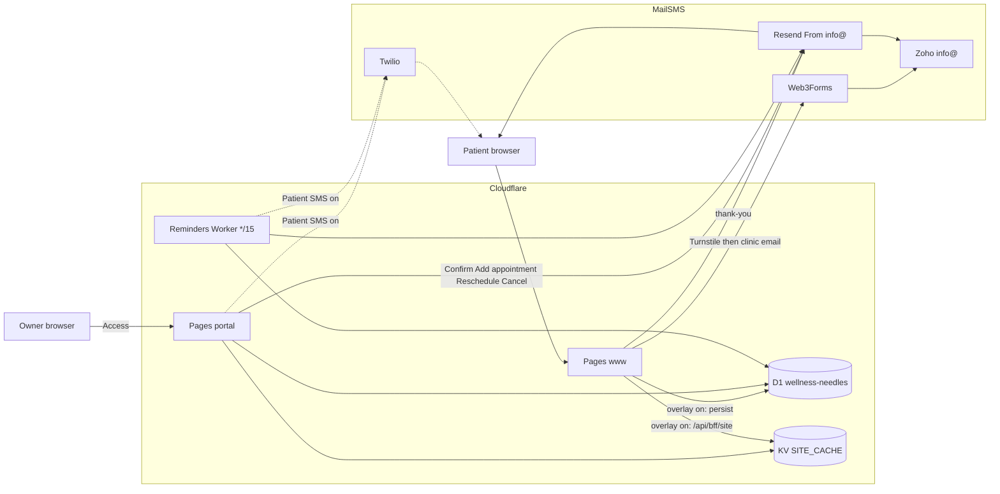
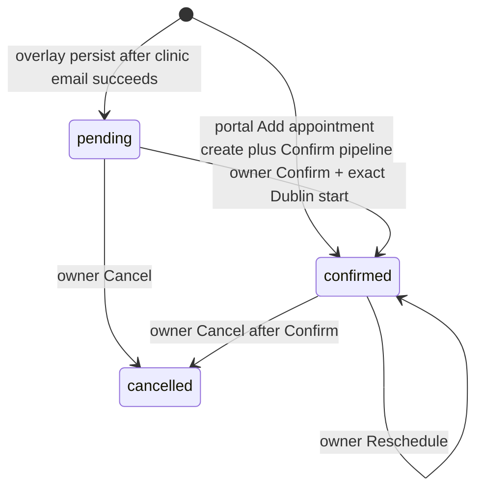
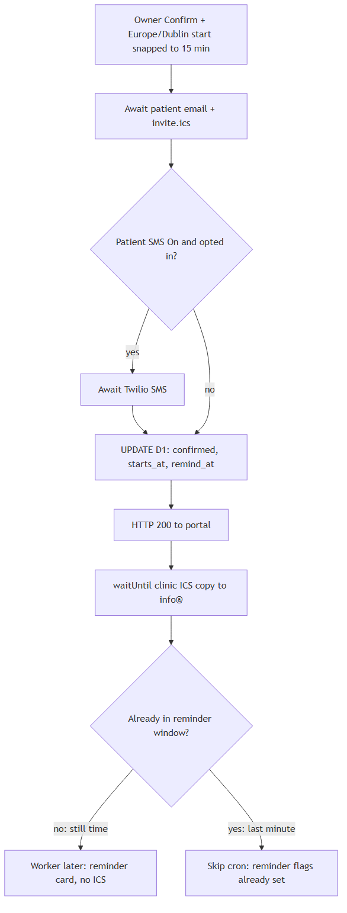
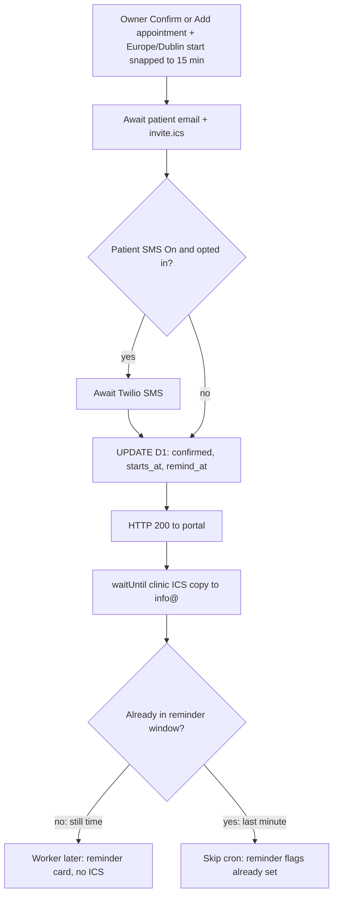
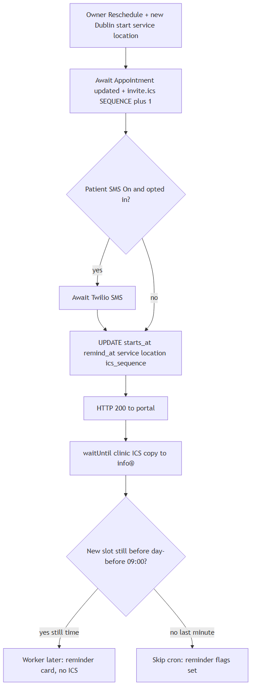
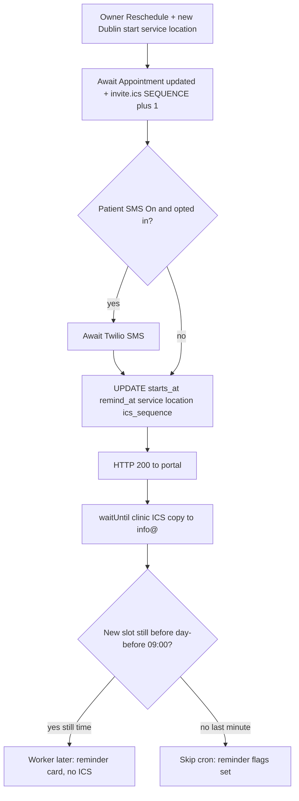

# Architecture

System shape for the public site, owner portal, website-form bookings, and portal Add appointment. Clinic-owner wording: [OWNER-BOOKINGS.md](OWNER-BOOKINGS.md). Portal operations: [PORTAL.md](PORTAL.md).

## Runtimes

| Piece | Where | Role |
|-------|--------|------|
| www | Cloudflare Pages `wellness-needles` → `www.wellnessneedles.ie` | Static Next export + booking/thank-you Functions. Public BFF only when the overlay kill switch is `"true"`. |
| Portal | Cloudflare Pages `wellness-needles-portal` → `portal.wellnessneedles.ie` | Owner UI behind Access. `/api/admin` lives **only** here. Add appointment, Confirm, Reschedule, Cancel, Publish overlay, Patient SMS switch. |
| Reminders | Worker `wellness-needles-reminders` cron `*/15` | Day-before reminder email (and SMS if enabled). No ICS. |
| D1 `wellness-needles` | EU, binding `DB` | Bookings, reviews, site draft/published JSON, publish history. Bound on **www, portal, and Worker**. |
| KV `SITE_CACHE` | Binding `SITE_CACHE` | Published site snapshot for www overlay. Portal writes; www reads. Not required on the Worker. |
| Resend | Secret `RESEND_API_KEY` on www, portal, Worker | From `Wellness Needles <info@wellnessneedles.ie>`. Thank-you, confirm, combined, reschedule, reminder, cancel. |
| Web3Forms | Browser after Turnstile | Clinic copy of the **request** to `info@`. Not the confirmed slot. |
| Twilio | Portal + Worker only | Optional patient SMS. Never on www. |

Do not put Access on www. Do not put `/api/admin` on www. Do not put Twilio on www. Do not change apex, www, or Zoho MX.

Mermaid source: [architecture-system.mmd](architecture-system.mmd).

## Overlay

www stays on baked `contact-config.ts` until **both** are true:

1. Production Release sets `NEXT_PUBLIC_SITE_OVERLAY_ENABLED=true`.
2. Settings → **Public website overlay** is Published.

Then www fetches `/api/bff/site` (KV). Fetch/parse failure falls back to baked content. Overlay off: Turnstile + Web3Forms + thank-you still run; **no** D1 persist; **no** Appointments card.

Patient SMS is a separate Published switch (default off).

## Booking lifecycle

Website form (overlay persist) and portal **Add appointment** (phone/walk-in) both write D1. Calendly and Fresha do not.

| Status | Inbox | Mail |
|--------|--------|------|
| `pending` | Appointments → Pending | Website thank-you already sent at submit. Confirm or Cancel next. Portal create can land here if Confirm fails after INSERT — Confirm from Pending; do not Add appointment again. |
| `confirmed` | Appointments → Confirmed | Patient card + `invite.ics`. Portal create uses this path immediately. Reschedule sends **Appointment updated** + replacement ICS (`SEQUENCE` + 1). Day-before reminder unless already in the reminder window. |
| `cancelled` | Appointments → Cancelled (look-up only) | Pending: could not confirm (no ICS). Confirmed: cancel notice + `METHOD:CANCEL` at `ics_sequence + 1`. No restore. |

`starts_at` is UTC ISO for the exact Europe/Dublin slot. `remind_at` is 09:00 Europe/Dublin on the **calendar day before** `starts_at`. Combined Confirm (already `remind_at <= now`) sets reminder sent flags so the Worker does not send again.

Duration on the ICS block (no schema column): published `pricing.serviceCopy.durationMinutes` when the service name matches, otherwise Initial **75**, follow-up or package **45**, else **60**.

Overlay-on `/bookings/` catalog uses portal Pricing copy (name, description, duration) plus Cupping and Moxibustion on/off. Preferred-time cards clip Morning 9–12 / Afternoon 12–4 / Evening 4–close to that weekday’s published hours and show **12-hour AM/PM**. Overlay-off keeps baked `booking-catalog.ts` and Evening 4–7. `BOOKABLE_PRICE_KEYS` stays the four appointment types (not Cupping or Moxibustion).

## Confirm pipeline

Critical path is **patient first, then D1, then clinic copy in the background**. A slow `info@` send must not leave the row pending after the patient was emailed.

Mermaid source: [architecture-confirm-pipeline.mmd](architecture-confirm-pipeline.mmd). Numbered sequence: [booking-sequence-confirm.mmd](booking-sequence-confirm.mmd).

Portal picker, Confirm click, and `POST /api/admin/bookings/:id` all snap `YYYY-MM-DDTHH:mm` to `:00 / :15 / :30 / :45` (`shared/quarter-hour.ts`). `23:53` becomes the **next calendar day** `00:00`. Website Confirm body stays `{ action: 'confirm', startsAtLocal }`. Phone/walk-in use `POST /api/admin/bookings` `{ action: 'create', startsAtLocal, firstName, lastName, email, phone, serviceType, locationLabel, serviceLabel, smsOptIn }` then the same Confirm helper (no request-received thank-you).

Cancel uses the same order: patient mail → D1 `cancelled` → `waitUntil` clinic CANCEL copy when the row was already confirmed.

## Reschedule pipeline

Same order as Confirm. Owner opens Appointments → **Confirmed**, picks a new Europe/Dublin start (15-minute snap), service, and location. Current service/location remain valid even if later unpublished.

Mermaid source: [architecture-reschedule-pipeline.mmd](architecture-reschedule-pipeline.mmd). Numbered sequence: [booking-sequence-reschedule.mmd](booking-sequence-reschedule.mmd).

`POST /api/admin/bookings/:id` `{ action: 'reschedule', startsAtLocal, serviceType, locationLabel, serviceLabel }` — confirmed rows only. Confirm body stays `{ action: 'confirm', startsAtLocal }`.

If the new `remind_at` is still in the future, reminder flags are cleared so the Worker can send. If already in the window, flags are set and there is no extra “See you tomorrow”.

## Email and calendar

| Event | HTML | ICS | Clinic |
|-------|------|-----|--------|
| Submit thank-you | Request received (www `/api/booking-thank-you`) | None | Request already arrived via Web3Forms |
| Portal create (phone/walk-in) | Same Confirm card (no request-received mail) | Same REQUEST SEQUENCE 0 | Same `waitUntil` copy |
| Confirm (still before day-before 09:00) | Card, status **Appointment confirmed**, title **See you soon, {first}!** | `METHOD:REQUEST` UID `{bookingId}@wellnessneedles.ie` **SEQUENCE 0** | `waitUntil` copy, same UID |
| Combined (day-before after 09:00, or same day) | Same card (inbox subject still `Confirmed, see you then`) | Same REQUEST SEQUENCE 0 | Same |
| Reschedule | Card, status **Appointment updated**, title **See you soon, {first}!** | Same UID, **SEQUENCE = ics_sequence + 1** | Same |
| Reminder (Worker) | Card, status **Your appointment is tomorrow**, title **See you tomorrow, {first}!** | **None** | None |
| Cancel pending | Plain notice | None | None |
| Cancel confirmed | Plain notice | `METHOD:CANCEL` same UID, SEQUENCE = `ics_sequence + 1` (still **1** if never rescheduled) | `waitUntil` copy |

Card layout (confirm / combined / reminder / reschedule): status line, then personal title, then greeting `Hi {first name}, we look forward to seeing you.` Service, Date + Time, Location. **Add to Calendar** (Google template) + **Get Directions** on one row, **Call Wellness Needles** below. Footer on confirm/combined/reschedule: calendar invite attached for Apple/Outlook.

ICS attach failure retries the patient email without the file. The clinic still gets the dedicated `waitUntil` copy when patient mail succeeded.

Zoho: Calendar on for `info@`. The first invite often needs **Add**. Patient mail is To-only (no Cc). Clinic calendar is the second Resend To `info@`.

Rows confirmed **before** ICS shipped have no prior REQUEST. Later Cancel still sends CANCEL with today’s UID — it will not match an old calendar event.

`bookings.ics_sequence` defaults to `0`. Confirm does not write it. Each reschedule increments it. Do not re-run full `d1/schema.sql` to add the column — use [d1/alter-bookings-ics-sequence.sql](../d1/alter-bookings-ics-sequence.sql) once **before** deploying portal Reschedule.

Not built: same-day reminder.

## Shared code

| Module | Used by | Purpose |
|--------|---------|---------|
| `functions/_lib/email-brand.ts` | www thank-you, portal/Worker notify | Colours, rows, pills, maps, location parse (Celbridge street `56 The Orchard, Oldtown Mill`) |
| `functions/_lib/notify.ts` | Portal Confirm/Reschedule/Cancel, reminder Worker | Card copy, ICS, Resend, Twilio, Dublin `remind_at` |
| `functions/_lib/confirm-booking.ts` | Portal Confirm and Add appointment | Shared Confirm helper. Create validates published lists then INSERT pending and runs the same pipeline |
| `shared/email-check.ts` | www booking form, `/api/booking-email-check`, portal create email | Format parse, typo suggestion, MX via Cloudflare DoH (fail-open). Typo does not block submit |
| `shared/quarter-hour.ts` | Portal UI, Confirm/Reschedule/create API | 15-minute snap + Dublin datetime-local |
| `shared/twelve-hour.ts` | Portal hours + Confirm/Reschedule/Add appointment pickers | 12-hour AM/PM UI; stored values stay 24-hour |
| `shared/preferred-time-windows.ts` | www booking form | Clip preferred-time cards to published hours |
| `shared/booking-options.ts` | Portal Confirmed tab, Reschedule and Add appointment APIs | Allowed service/location catalogs |
| `shared/site-snapshot.ts` | www overlay, portal Settings | Published clinic JSON (`serviceCopy`, cupping/moxibustion flags) |
| `src/lib/overlay-public.ts` | www `/bookings/` | Overlay catalog names, prices, add-on flags |

Unit tests: `npm run test:unit`.

## Process flows

| Audience | Doc | Diagrams |
|----------|-----|----------|
| Clinic owner | [OWNER-BOOKINGS.md](OWNER-BOOKINGS.md) | Owner flowchart (website + Add appointment) + [owner-booking-process.mmd](owner-booking-process.mmd) |
| Technical request | [PORTAL.md](PORTAL.md#patient-booking-request-flow-technical) | [booking-sequence-request.mmd](booking-sequence-request.mmd) |
| Technical Confirm / Add appointment / reminder | same | [booking-sequence-confirm.mmd](booking-sequence-confirm.mmd) (create INSERT then this pipeline) |
| Technical Reschedule | same | [booking-sequence-reschedule.mmd](booking-sequence-reschedule.mmd) |
| Technical Cancel | same | [booking-sequence-cancel.mmd](booking-sequence-cancel.mmd) |

Request persist is fire-and-forget after Web3Forms success. Persist failure does not block the clinic email. Thank-you is “request received”, not a slot.

## Deploy surfaces

| Change | Deploy |
|--------|--------|
| Confirm / Add appointment / Reschedule / Cancel card + ICS + snap | **Portal** (run D1 `ALTER` for `ics_sequence` first) |
| Website email check (`/api/booking-email-check`) | **www** (production Release) |
| Day-before reminder card | **Worker** `wellness-needles-reminders` |
| Thank-you / `email-brand.ts` | **www** (production Release) |
| Overlay kill switch | `NEXT_PUBLIC_SITE_OVERLAY_ENABLED` in `.github/workflows/deploy-production.yml` (build **and** deploy), then Release. Not the Cloudflare dashboard. |
| Schema | `d1/schema.sql` only when tables/columns change. Overlay, SMS, reminders, and ICS need **no** schema re-run. |

Production www goes live on **GitHub Release** of `main`, not on merge. Staging is Vercel from `dev`.

Captcha rollback (Turnstile ↔ hCaptcha) is independent: [CAPTCHA_ROLLBACK.md](CAPTCHA_ROLLBACK.md).
