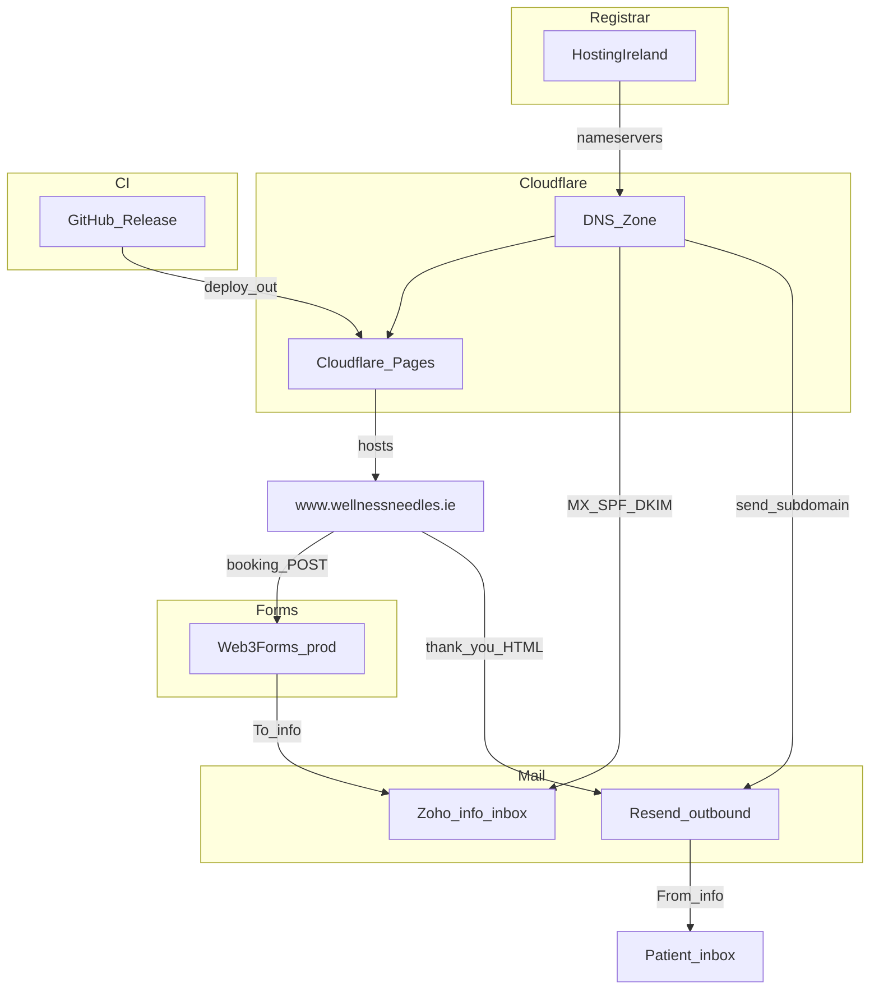
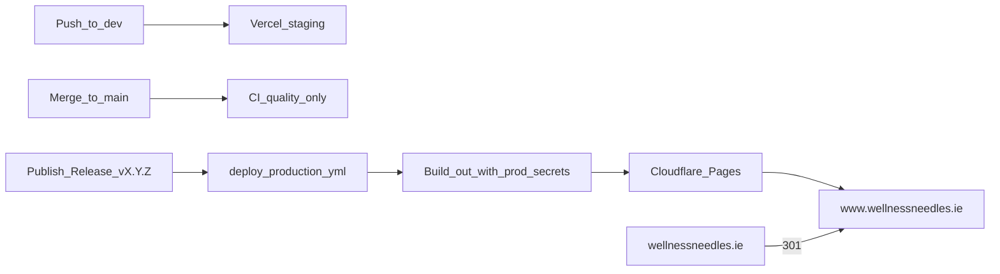
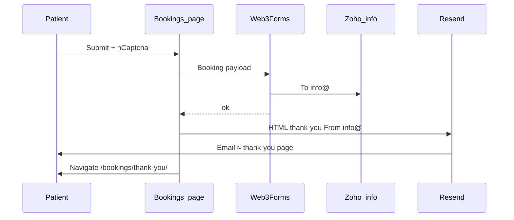
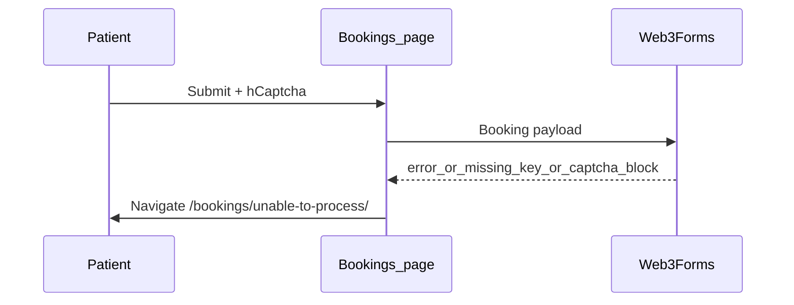

# Wellness Needles — Phase 1 Go-Live Architecture & Design

**Status:** Locked for Phase 1 (updated 2026-08-13)  
**Working branch for engineering:** `dev` first (verify on Vercel staging) → then `main` → **GitHub Release** for production  
**Do not commit** until explicitly asked  

**Canonical production URL:** `https://www.wellnessneedles.ie`  
**Apex:** `https://wellnessneedles.ie` → **301** → www  
**Staging:** `https://wellness-needles.vercel.app`  
**Skipped this phase:** Supabase, owner portal (`portal.wellnessneedles.ie`), moderated reviews, live settings editor  

---

## 1. Goals (Phase 1)

1. Host marketing site on **Cloudflare Pages** (project: `wellness-needles`)
2. Deploy production **only** via **GitHub Release published** (merge to `main` = CI only)
3. Clinic receives booking emails at **`info@wellnessneedles.ie`** (Zoho via Web3Forms)
4. Patient receives thank-you email **≈ thank-you page**, **From `info@`** (Resend)
5. Remove marketing **`/admin`**
6. On booking **submit failure** → show **apology page** `/bookings/unable-to-process/`

---

## 2. System architecture



### Who owns what

| Component | Role |
|-----------|------|
| Hosting Ireland | Domain registrar only |
| Cloudflare DNS | Apex, www, Zoho mail records, Resend send records |
| Cloudflare Pages | Static Next.js `out/` host — project `wellness-needles` |
| Zoho Mail | Inbound `info@wellnessneedles.ie` |
| Web3Forms | Clinic booking notification only (Autoresponder **OFF**) |
| Resend | Patient thank-you From `info@` |
| GitHub Actions | Staging → Vercel on `dev`; Prod → CF Pages on **Release** |

### Custom domains (Pages)

| Hostname | Role | Status (owner) |
|----------|------|----------------|
| `www.wellnessneedles.ie` | Canonical site visitors use | **Active** |
| `wellnessneedles.ie` | Apex; must 301 → www | **Active** |

Visitors / links / sitemap / OG / email CTAs: **`https://www.wellnessneedles.ie`**.

---

## 3. Deploy design



| Event | Effect |
|-------|--------|
| Push / work on `dev` | Staging only (`https://wellness-needles.vercel.app`) |
| Merge `main` | CI only — **no** live deploy |
| **Publish GitHub Release** | Production deploy to Cloudflare Pages |

**Current repo (must change for prod):** [`.github/workflows/deploy-production.yml`](C:/src/Test/wellness-needles/.github/workflows/deploy-production.yml) still uses `workflow_run` on `main` → **Vercel**. Target:

```yaml
on:
  release:
    types: [published]
```

Prefer **Direct Upload / GHA** (`wrangler pages deploy`) — do **not** connect Cloudflare “GitHub auto-deploy” (fights release-only gate).

### Dev-first engineering rule (LOCKED)

1. Implement Phase 1 code/workflow changes on **`dev`**
2. Verify on **Vercel staging** (booking paths, apology page, no broken routes)
3. Only then merge to `main` and publish a **Release** for Cloudflare production
4. **Do not commit** until the owner explicitly asks

---

## 4. Booking UX & email design

### Happy path



### Failure path (LOCKED — apology page)



| Outcome | Site page | Clinic email | Patient email |
|---------|-----------|--------------|---------------|
| Web3Forms **success** | `/bookings/thank-you/` | Yes → `info@` | Resend ≈ thank-you page |
| Web3Forms **failure** / not configured / send error | **`/bookings/unable-to-process/`** | No | No |
| Captcha incomplete | Stay on form (inline error) | No | No |
| Resend fails **after** Web3Forms OK | Still `/bookings/thank-you/` (clinic has request) | Yes | Retry/log; do not show apology |

**Apology page:** `src/app/bookings/unable-to-process/page.tsx`  
**Submit helper:** `goToUnableToProcess()` in `src/components/BookingForm.tsx`

**Must keep:** any failed clinic booking send → `window.location.replace('/bookings/unable-to-process/')`. Never soft-fail to thank-you if the clinic never got the request.

### Web3Forms (prod) — locked settings

| Setting | Value |
|---------|--------|
| Website URL | `https://www.wellnessneedles.ie/bookings/` |
| Redirect | `https://www.wellnessneedles.ie/bookings/thank-you/` |
| Recipient | `info@wellnessneedles.ie` |
| Subject | `New booking request — Wellness Needles` |
| hCaptcha | On |
| Autoresponder | **OFF** |

### Patient email (Resend)

| Field | Value |
|-------|--------|
| From | `Wellness Needles <info@wellnessneedles.ie>` |
| To | Patient email |
| Body | ≈ `/bookings/thank-you/` — logo, confirmation rows, Need help card |
| Transport | Resend API (Pages Function / Worker — key **not** in browser) |
| Free tier | ~3k/mo, ~100/day — OK for clinic volume |

---

## 5. DNS design

| Record class | Keep / set |
|--------------|------------|
| Zoho MX + SPF + DKIM | Keep — **DNS only** |
| `mail` A | Keep — **DNS only** (never proxied) |
| `www` | CNAME → Pages (`wellness-needles.pages.dev`) — Active |
| Apex | Attached to Pages — Active; **301 → www** (Single Redirect, Free plan) |

> **Post-live (2026-08-13):** Phones typing `https://www.wellnessneedles.ie` still hit Azure via stale DNS → blue 404 / bad cert. Permanent fix: Cloudflare DNS lock + **decommission Azure custom domains** + Hosting Ireland **NS only**. See [POST_LIVE_WWW_DNS_SSL.md](./POST_LIVE_WWW_DNS_SSL.md). Ops: `Ops — Fix www DNS` (token needs **Zone → DNS → Edit**).
| Resend `send.*` | Keep alongside Zoho — do **not** remove Zoho root MX |

### Apex → www redirect (Free — no extra cost)

| | |
|--|--|
| Match | `https://wellnessneedles.ie/*` |
| Target | `https://www.wellnessneedles.ie/${1}` |
| Status | **301** |
| Preserve query string | On |

---

## 6. Production GitHub secrets

| Secret | Purpose | Status |
|--------|---------|--------|
| `NEXT_PUBLIC_WEB3FORMS_ACCESS_KEY_PRODUCTION` | Prod Web3Forms | **Done** |
| `CLOUDFLARE_ACCOUNT_ID` | CF deploy | **Done** |
| `CLOUDFLARE_API_TOKEN` | CF deploy | **Done** |
| `RESEND_API_KEY` | Patient thank-you | **Done** |

Staging-only (unchanged): `NEXT_PUBLIC_WEB3FORMS_ACCESS_KEY`, `VERCEL_*`

---

## 7. Phase 1 checklist

### Done (owner)

- [x] Domain at Hosting Ireland; NS → Cloudflare (`anderson` / `erin`); zone Active
- [x] Zoho `info@` + MX/SPF/DKIM
- [x] Pages project `wellness-needles`
- [x] Custom domains: **www** Active + **apex** Active
- [x] Prod Web3Forms (To `info@`, hCaptcha on, Autoresponder off)
- [x] GitHub secrets: Web3Forms prod, Cloudflare ID/token, Resend API key
- [x] Resend account + domain verified

**Verified 2026-08-13:** Zoho MX present (`mx.zoho.eu`, `mx2.zoho.eu`, `mx3.zoho.eu`).  
**Pages status:** Custom domains Active; site returns **522** until the first Release deploy uploads assets.  
**Apex → www:** `public/_redirects` ships with the deploy; also add a zone **Redirect Rule** (Free) as defense in depth.

### Remaining owner

- [ ] Confirm apex → www **301** after first deploy (and/or zone Redirect Rule)
- [x] Spot-check Zoho MX still present

### Remaining engineering (on `dev` first — no commit until asked)

- [x] Rewrite `deploy-production.yml`: `on: release: types: [published]` → build `out/` → `wrangler pages deploy`
- [x] Wire `NEXT_PUBLIC_WEB3FORMS_ACCESS_KEY_PRODUCTION` in release build
- [x] Remove `/admin` + Admin nav; update docs/e2e as needed
- [x] Resend thank-you ≈ page From `info@` (Pages Function; key not in browser)
- [x] Keep / verify apology path on Web3Forms failure
- [ ] Verify on Vercel staging from `dev` (**after push** — local e2e passed)
- [ ] Merge → publish first Release → QA on `https://www.wellnessneedles.ie`

### Explicitly out of Phase 1

- Supabase schema/UI
- `portal.wellnessneedles.ie`
- Moderated reviews / live settings editor

---

## 8. QA acceptance (go-live)

1. Changes verified on **staging** (`dev`) before production Release  
2. Merge to `main` does **not** change live site  
3. Publishing `vX.Y.Z` updates `https://www.wellnessneedles.ie`  
4. Apex redirects to www  
5. Successful booking → clinic email at `info@` + patient email From `info@` ≈ thank-you page + site thank-you page  
6. Failed Web3Forms send → **apology** `/bookings/unable-to-process/`  
7. No `/admin` on production  
8. `info@` still receives normal mail (Zoho intact)  

---

## 9. Cost notes (Phase 1)

| Item | Notes |
|------|--------|
| Cloudflare Pages + DNS | Free tier for this site |
| Single Redirect (apex→www) | Free (10 rules/zone; need 1) |
| Vercel staging | Existing staging on `dev` |
| Resend | Free tier sufficient for thank-yous |
| Zoho / Web3Forms | Existing clinic mail + form |
| Vercel **production** Pro | Avoided by moving prod to CF Pages |
