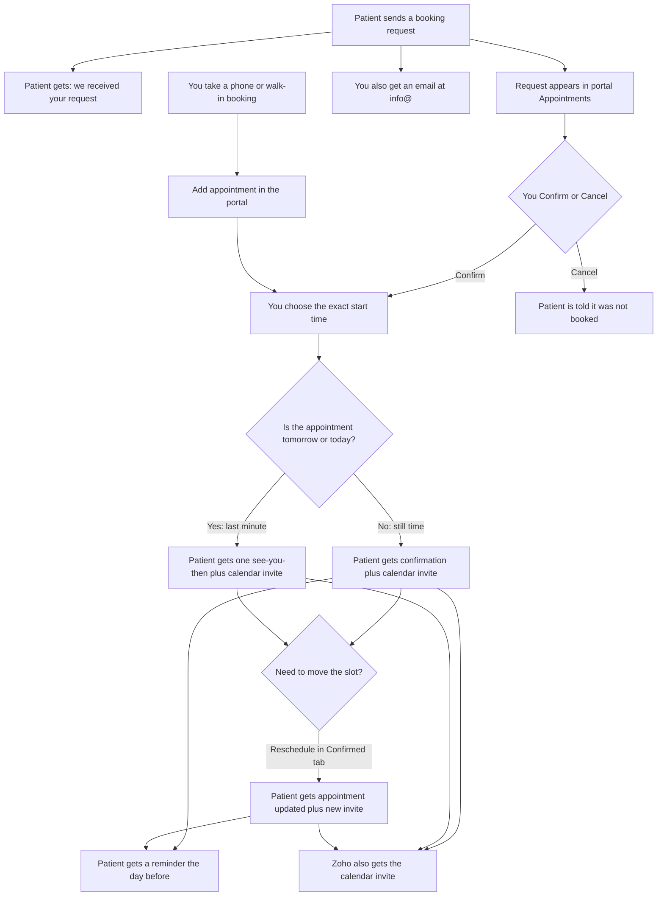

# How bookings work

For the clinic owner. Website form requests land in **Pending**. Phone and walk-in bookings you take yourself use **Add appointment** — they go straight to **Confirmed** and send the same patient card and calendar invite. Calendly and Fresha still do not appear in Appointments.

Technical architecture and Confirm order: [ARCHITECTURE.md](ARCHITECTURE.md). Sequence diagrams (request, Confirm/reminder, Reschedule, Cancel): [PORTAL.md](PORTAL.md#sequence-diagrams).

Mermaid source: [owner-booking-process.mmd](owner-booking-process.mmd).

## What you do

1. Open **Appointments** in the portal (`https://portal.wellnessneedles.ie`).
2. Open the request. You will see the patient’s name, phone, email, preferred day/time window, and whether they asked for SMS. Use search on Pending, Confirmed, or Cancelled to find someone by name, phone, or email.
3. **Confirm** if you can take them. Enter the exact start in **12-hour Ireland time** (15-minute steps). That is the time they will be told. A calendar invite also goes to the patient and to `info@` (Zoho). You do not type the slot into Zoho by hand.
4. **Reschedule** from the **Confirmed** tab if you need a new Ireland time, service, or clinic. The patient gets an “Appointment updated” email and a replacement calendar invite. Zoho gets the same invite.
5. **Cancel** if you cannot take them. If you already Confirmed, the calendar invite is cancelled too. The row moves to the **Cancelled** tab so you can look it up. You cannot restore it from there.

## Phone and walk-in

When you book someone by phone or in person (not the website form):

1. Open **Appointments** and choose **Add appointment**.
2. Enter their name, email, phone (same checks as the website form), visit type, location, service, and the exact Ireland start (not a past date).
3. Tick **Patient asked for SMS** only if they want texts (and Patient SMS is published On).
4. Choose **Confirm appointment**. They get the same confirmation card and calendar invite as a website Confirm. The row appears under **Confirmed**. Reschedule and Cancel work as usual.

Do not send a “request received” note for these — the slot is already agreed. Calendly and Fresha are not imported.

If Confirm appointment does not finish, look under **Pending** and Confirm from there. Do not click Add appointment again or you will get a duplicate.

Confirm and day-before reminder emails are a scannable card (status line, then **See you soon/tomorrow, {name}!**, then “Hi {name}, we look forward to seeing you.”):

- Service, Date + Time, and Location
- **Add to Calendar** and **Get Directions** on one row, **Call Wellness Needles** underneath
- Confirm / last-minute / reschedule: attached invite for Apple/Outlook; Add to Calendar opens Google Calendar
- Day-before reminder title is **See you tomorrow, {name}!** (no second calendar file)

You do not send the reminder yourself. After a normal Confirm, the patient is reminded automatically the **calendar day before** the appointment (from 9:00am Ireland time).

The calendar block uses the duration published in Pricing when the service name matches. Otherwise it is Initial **75 minutes**, Follow-up or package **45 minutes**, anything else **60 minutes**. Patient Morning / Afternoon / Evening windows on the website follow your published hours (Ireland 12-hour). Confirm still sets the exact time. In Zoho Mail, open the invite and **Add** it to Calendar if it does not appear on its own (Calendar must be on for `info@`).

## What the patient gets

| When | Email | Subject |
|------|-------|---------|
| They submit the form | Request received (not a confirmed slot) | Appointment request received — Wellness Needles |
| You Confirm in good time | Appointment card + calendar invite | Wellness Needles — appointment confirmed |
| You Add appointment (phone / walk-in) | Same confirmation card + calendar invite (no “request received”) | Wellness Needles — appointment confirmed |
| You Confirm late (day before after 9:00am, or same day) | Same card — “See you soon, {name}!” No second reminder | Confirmed, see you then |
| You Reschedule a confirmed appointment | Same card — “See you soon, {name}!” + replacement invite | Wellness Needles — appointment updated |
| The calendar day before, from 9:00am | Same card as a reminder, “See you tomorrow, {name}!” (no extra calendar file) | Reminder — your appointment is tomorrow |
| You Cancel a new request | We could not confirm this request | Wellness Needles — we could not confirm this request |
| You Cancel a confirmed appointment | Appointment cancelled + calendar cancel | Wellness Needles — appointment cancelled |

Not sent today: same-day reminder.

**SMS** is extra. It is a short labeled text (not the HTML card), and only if:

- Settings → **Patient SMS** is On, then **Publish**
- the patient ticked **Text me appointment updates** on the form, or you ticked **Patient asked for SMS** on Add appointment

If either is off, they still get email.

## Example

Patient asks for Wednesday afternoon. You Confirm for Wednesday 2:00pm.

- They get the confirmation now, with a calendar invite.
- `info@` / Zoho gets the same invite.
- They get the reminder on Tuesday from 9:00am (email only — no second calendar invite).

If you later move them to Friday 11:00am (or change clinic/service), they get “Appointment updated” with a new calendar invite. The Tuesday reminder is not sent if you moved them after it would have gone; they get a reminder the day before the **new** slot instead.

## Settings that must be on

- **Public website overlay** On and Published — otherwise the form still emails you, but the request will **not** show in Appointments.
- **Patient SMS** On and Published — otherwise no SMS (email still works).
