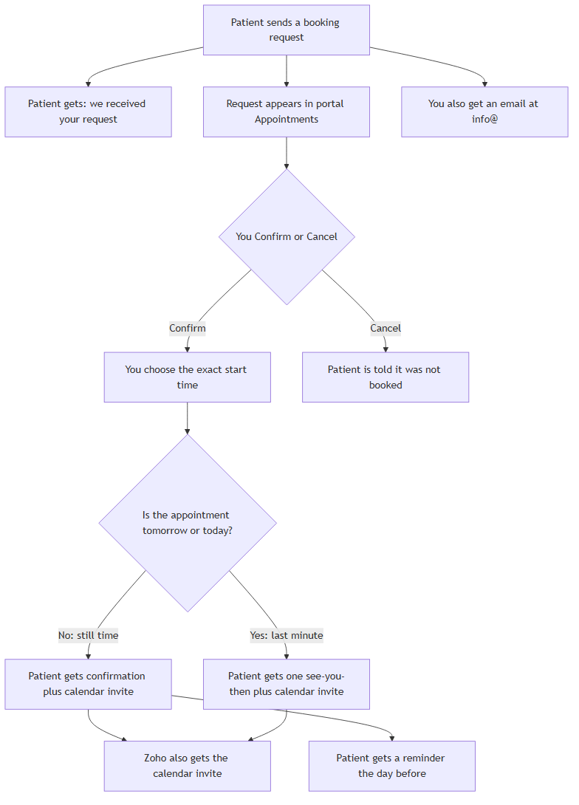
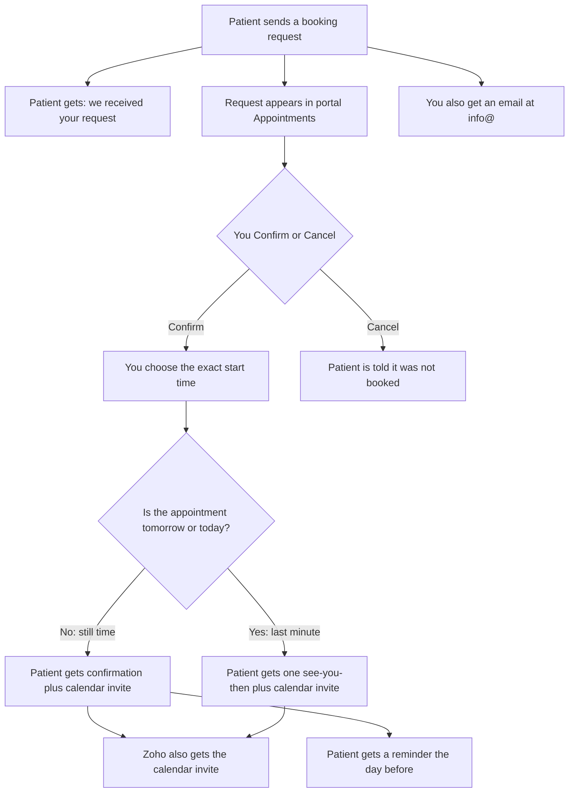

# How website bookings work

For the clinic owner. This is only for requests sent through the **website booking form**. Phone, Calendly, and Fresha bookings do not appear in Appointments.

Technical architecture and Confirm order: [ARCHITECTURE.md](ARCHITECTURE.md). Sequence diagrams (request, Confirm/reminder, Cancel): [PORTAL.md](PORTAL.md#sequence-diagrams).

Mermaid source: [owner-booking-process.mmd](owner-booking-process.mmd).

## What you do

1. Open **Appointments** in the portal (`https://portal.wellnessneedles.ie`).
2. Open the request. You will see the patient’s name, phone, email, preferred day/time window, and whether they asked for SMS.
3. **Confirm** if you can take them. Enter the exact start time (Ireland time, 15-minute steps). That is the time they will be told. A calendar invite also goes to the patient and to `info@` (Zoho). You do not type the slot into Zoho by hand.
4. **Cancel** if you cannot take them. If you already Confirmed, the calendar invite is cancelled too.

Confirm and day-before reminder emails are a scannable card (first name only in the greeting: “Hi {name}, we look forward to seeing you.”):

- Date, Time, and Location on separate rows
- **Add to Calendar** and **Get Directions** on one row, **Call Wellness Needles** underneath
- Confirm / last-minute: attached invite for Apple/Outlook; Add to Calendar opens Google Calendar
- Day-before reminder heading is **See you tomorrow** (no second calendar file)

You do not send the reminder yourself. After a normal Confirm, the patient is reminded automatically the **calendar day before** the appointment (from 9:00am Ireland time).

The calendar block is Initial **75 minutes**, Follow-up or package **45 minutes**, anything else **60 minutes**. In Zoho Mail, open the invite and **Add** it to Calendar if it does not appear on its own (Calendar must be on for `info@`).

## What the patient gets

| When | Email | Subject |
|------|-------|---------|
| They submit the form | Request received (not a confirmed slot) | Appointment request received — Wellness Needles |
| You Confirm in good time | Appointment card + calendar invite | Wellness Needles — appointment confirmed |
| You Confirm late (day before after 9:00am, or same day) | Same card — “See you then.” No second reminder | Confirmed, see you then |
| The calendar day before, from 9:00am | Same card as a reminder, heading “See you tomorrow” (no extra calendar file) | Reminder — your appointment is tomorrow |
| You Cancel a new request | We could not confirm this request | Wellness Needles — we could not confirm this request |
| You Cancel a confirmed appointment | Appointment cancelled + calendar cancel | Wellness Needles — appointment cancelled |

Not sent today: same-day reminder, reschedule.

**SMS** is extra. It is a short labeled text (not the HTML card), and only if:

- Settings → **Patient SMS** is On, then **Publish**
- the patient ticked the reminder box on the form

If either is off, they still get email.

## Example

Patient asks for Wednesday afternoon. You Confirm for Wednesday 2:00pm.

- They get the confirmation now, with a calendar invite.
- `info@` / Zoho gets the same invite.
- They get the reminder on Tuesday from 9:00am (email only — no second calendar invite).

If you Confirm on Tuesday afternoon (or on Wednesday), they get one “see you then” instead of two emails.

## Settings that must be on

- **Public website overlay** On and Published — otherwise the form still emails you, but the request will **not** show in Appointments.
- **Patient SMS** On and Published — otherwise no SMS (email still works).
