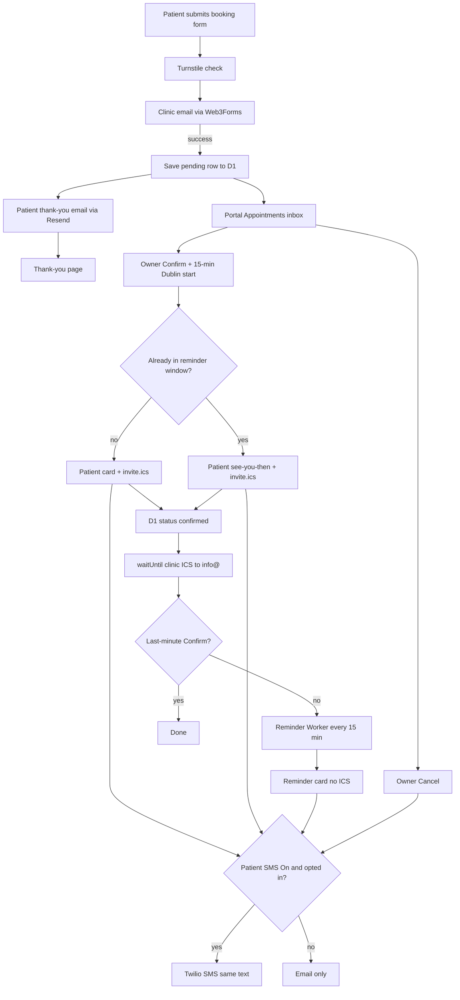
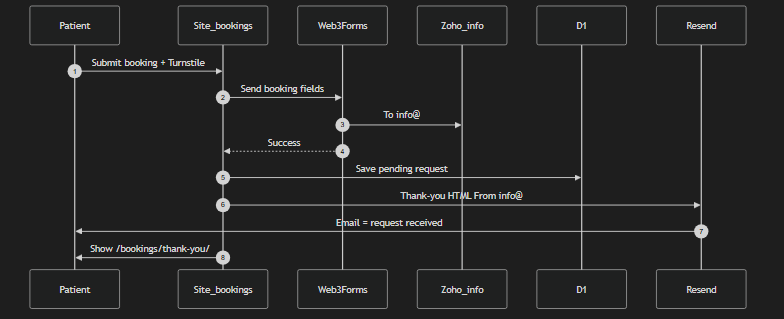
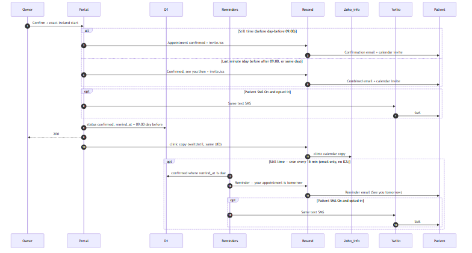
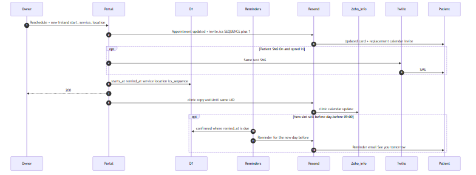
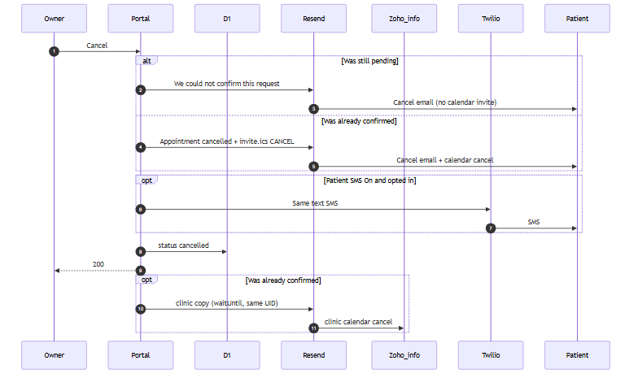

# Owner portal

Public site: `https://www.wellnessneedles.ie`  
Owner portal: `https://portal.wellnessneedles.ie` (Cloudflare Access)

How bookings work for the clinic: [OWNER-BOOKINGS.md](OWNER-BOOKINGS.md).  
System architecture (runtimes, Confirm pipeline, ICS): [ARCHITECTURE.md](ARCHITECTURE.md).

www stays on baked marketing content until **both** are true:

1. Production Release bakes `NEXT_PUBLIC_SITE_OVERLAY_ENABLED=true` (allows www to fetch `/api/bff/site`).
2. Settings → **Public website overlay** is published on.

If the overlay API fails, www keeps the baked site automatically. You do not redeploy for that.

## Overlay off-ramps

1. **Automatic.** Fetch/parse/BFF failure → baked `contactConfig`, catalogs, and Google review cards. Booking email still uses Turnstile + Web3Forms.
2. **Owner switch (no Release).** Turn off **Public website overlay** and Publish. www returns to baked content on the next fetch (KV/CDN up to ~60s).
3. **Release kill switch.** Set `NEXT_PUBLIC_SITE_OVERLAY_ENABLED: "false"` in `.github/workflows/deploy-production.yml` (build **and** deploy steps) and cut a production Release. Client never fetches overlay, and www deploys **booking Functions only** (no `/api/bff`), same as live today.

Do not set this in the Cloudflare dashboard — `NEXT_PUBLIC_*` is baked at build time. The workflow line is the switch.

## Settings

| Switch | Default | Effect after Publish |
|--------|---------|----------------------|
| Public website overlay | off until you turn it on | www uses portal hours, contact, pricing, locations, insurers, booking mode |
| Booking form / Calendly / Fresha | one channel required | mutually exclusive |
| Patient SMS | **off** | Shows the booking-form **Appointment reminders** checkbox (text me appointment updates) and the Add appointment **Patient asked for SMS** tick. Allows Twilio on confirm / reschedule / day-before reminder / cancel. Email still sends when this is off. |
| Booking maintenance | **off** | Non-dismissable “Online Appointment Requests Unavailable” modal on `/bookings` (Need help card inside). Overlay must be on. Turn off and Publish to restore online booking. |

Footer tagline, footer description, emergency note, and About insurance paragraphs are not edited in the portal (baked copy). Clinic name, hours, locations, insurance **logos** (add / remove / website URL), and pricing (including names, descriptions, durations, Cupping, and Moxibustion) are. Hours and Confirm / Reschedule / Add appointment exact-start pickers are **12-hour AM/PM**; stored values stay 24-hour `HH:mm` / `YYYY-MM-DDTHH:mm`. The date control does not offer days before today (Europe/Dublin). Add appointment phone uses the same country picker and Irish mobile rules as the website booking form.

## Cloudflare dashboard (before first production use)

1. D1 database (EU), bind as `DB` on **both** Pages projects **and** Worker `wellness-needles-reminders`
2. KV namespace, bind as `SITE_CACHE` on both Pages projects (not required on the Worker)
3. Pages project `wellness-needles-portal` (Git disconnected), custom domain `portal.wellnessneedles.ie`
4. Zero Trust Access on `portal.wellnessneedles.ie` and `*.wellness-needles-portal.pages.dev`
5. Portal secrets: `CF_ACCESS_AUD`, `CF_ACCESS_TEAM_DOMAIN`, `RESEND_API_KEY` (same key as www)
6. Worker `wellness-needles-reminders` secret: `RESEND_API_KEY` (day-before email)
7. Optional Twilio (patient SMS): `TWILIO_ACCOUNT_SID`, `TWILIO_AUTH_TOKEN`, `TWILIO_FROM` on **portal** and **the Worker**. `TWILIO_FROM` is the Twilio number (E.164). A branded name needs a ComReg-registered alphanumeric Sender ID (max 11 characters — “Wellness Needles” is too long). Do not put Twilio on www.
8. Apply schema: `npx wrangler d1 execute wellness-needles --file=d1/schema.sql` (re-run after schema changes; `site_change_history` is portal-only). System Settings shows published FROM → TO history (not draft typing). Do **not** re-run schema to enable overlay, SMS, or reminders.

Do **not** change apex, www, or Zoho MX. Do **not** put Access on www.

## Local

```bash
npm run dev                 # marketing site
npm --prefix portal install
npm --prefix portal run dev # portal UI on :3001 (APIs need wrangler pages dev)
npm run test:unit           # ICS, Dublin times, duration, 15-minute snap, email check, Add appointment
```

## How bookings work (clinic owner)

Plain-language process: [OWNER-BOOKINGS.md](OWNER-BOOKINGS.md). Architecture: [ARCHITECTURE.md](ARCHITECTURE.md). Appointments inbox, Confirm (exact Ireland time), Add appointment for phone/walk-in, Reschedule on Confirmed, automatic day-before reminder, optional SMS.

## Patient booking request flow (technical)

Overlay-on **website booking form** fills Pending. Phone and walk-in use portal **Add appointment** (create + same Confirm pipeline; no request-received thank-you). Calendly / Fresha are not imported. Runtimes and Confirm order: [ARCHITECTURE.md](ARCHITECTURE.md).



Patient SMS, when on, is sent with the patient email **before** D1 is updated. Clinic ICS is `waitUntil` **after** D1. Last-minute Confirm sets reminder flags so the Worker does not send again.

1. **Patient request (www).** Preferred date/time window, not an exact slot. Overlay-on windows follow published hours (Morning 9–12 / Afternoon 12–4 / Evening 4–close, 12-hour AM/PM; empty buckets are hidden). Overlay-off stays baked Evening 4–7. SMS checkbox (**Appointment reminders** / text me appointment updates) only if overlay is on **and** Patient SMS is published on. The form checks email format locally; a close domain typo is a clickable “Did you mean {email}?” suggestion (does not block). Live www also calls `/api/booking-email-check` (Cloudflare DoH MX, fail-open). Localhost and E2E skip MX. Turnstile must pass, then clinic email (`/api/booking-request` → Web3Forms). If that fails, the patient sees unable-to-process; nothing is saved to the portal.
2. **Persist.** On clinic-email success, if overlay is on, the browser fire-and-forget posts to `/api/bff/booking-persist`. Persist failure does **not** block the clinic email.
3. **Thank-you.** Resend `/api/booking-thank-you` is “request received”, not a confirmed appointment. Patient lands on `/bookings/thank-you/`.
4. **Portal inbox.** D1 row `status = pending` with preferred date/time and `sms_opt_in`. Appointments → **Pending** shows Confirm / Cancel. After Confirm, the row moves to **Confirmed** (Reschedule / Cancel). After Cancel, the row moves to **Cancelled** (read-only; no restore). Search (name, phone, email, service, location, slot) filters the open tab only; tab counts stay unfiltered.
5. **Add appointment (phone/walk-in).** Portal-only `POST /api/admin/bookings` `{ action: 'create', startsAtLocal, firstName, lastName, email, phone, serviceType, locationLabel, serviceLabel, smsOptIn }`. Phone uses the same country + Irish 08x mobile checks as the website form (E.164 on the wire). Exact start cannot be before now in Europe/Dublin. INSERT `pending`, then the same Confirm helper as step 6. No website request-received thank-you and no Web3Forms clinic request. If notify/D1 fails after INSERT, the row stays **Pending** — Confirm from there; do not create again.
6. **Confirm.** Owner sets an exact Europe/Dublin start (portal picker is 12-hour AM/PM; date min is today Dublin; API still receives `YYYY-MM-DDTHH:mm` and snaps to 15-minute steps). Past datetimes are rejected. Sets `starts_at` and `remind_at` = 09:00 Dublin on the calendar day before. Before that window: HTML appointment card + `invite.ics`; Worker reminds later. Already in the window: same card (inbox subject “Confirmed, see you then”); cron does not send again. Status **Appointment confirmed**, title **See you soon, {first}!**, greeting “Hi {first name}, we look forward to seeing you.” Card: Service, Date + Time, Location. Actions: Add to Calendar (Google template) and Get Directions on one row, Call Wellness Needles below. Patient email is awaited; D1 is updated next; clinic ICS copy is `waitUntil` after that so a slow `info@` send cannot leave the row pending. Patient mail is To-only (no Cc). Duration: published `serviceCopy.durationMinutes` when the service name matches, otherwise Initial 75 min, follow-up/package 45 min, else 60. ICS failure retries the email without the attachment. Website Confirm body remains `{ action: 'confirm', startsAtLocal }`.
7. **Reschedule.** Confirmed rows only. `{ action: 'reschedule', startsAtLocal, serviceType, locationLabel, serviceLabel }`. Same 15-minute snap. Same notify order (patient mail → D1 → `waitUntil` clinic ICS). Status **Appointment updated**, title **See you soon, {first}!**. ICS same UID, `SEQUENCE = ics_sequence + 1`. Current service/location stay valid if later unpublished. Recomputes `remind_at`; clears reminder flags if the new slot is still before the day-before window, otherwise sets them so the Worker does not send again.
8. **Cancel.** Pending: “we could not confirm this request” (plain text, no ICS). Already confirmed: “appointment cancelled” plus `METHOD:CANCEL` with the same UID and `SEQUENCE = ics_sequence + 1` (still 1 if never rescheduled). The row then appears on Appointments → **Cancelled** (name, contact, slot; no actions).
9. **Day-before reminder.** Worker `wellness-needles-reminders` (`*/15`) emails confirmed rows where `remind_at <= now` and `reminder_email_sent = 0`. Same HTML card as Confirm (status “Your appointment is tomorrow”, title “See you tomorrow, {first}!”); Google Calendar link only (no second ICS). There is no same-day reminder.

**SMS (optional, steps 6–9).** Twilio only if Patient SMS is published on, the patient opted in, and Twilio secrets are on **portal** (confirm/reschedule/cancel) and **Worker** (reminder). Short texts (first 160 characters), date without year: Confirm `Confirmed: {date} at {time} in {location}. Call {phone}`; combined `Confirmed — see you {date} at {time} in {location}. Call {phone}`; reschedule `Updated: {date} at {time} in {location}. Call {phone}`; reminder `Just a reminder: your appointment is {date} at {time} in {location}. See you then!`. SMS failure does not block email. www has no Twilio.

**Gates.** Overlay off: Turnstile + clinic email + thank-you still run; **no** D1 persist, **no** portal card. Patient SMS off: checkbox hidden; confirm/reschedule/cancel/reminder stay email-only.

### Sequence diagrams

Same style as the thank-you-email sequence (Patient → Site_bookings → Web3Forms → Zoho_info → Resend). Overlay-on production uses Turnstile, then adds D1 persist, portal Confirm/Add appointment/Reschedule/Cancel, day-before reminder, and optional Twilio. Confirm, Add appointment, and Reschedule order is patient mail → D1 → clinic ICS `waitUntil` ([ARCHITECTURE.md](ARCHITECTURE.md#confirm-pipeline)). Add appointment INSERTs a pending row first, then the Confirm sequence below.









Mermaid source: [booking-sequence-request.mmd](booking-sequence-request.mmd), [booking-sequence-confirm.mmd](booking-sequence-confirm.mmd), [booking-sequence-reschedule.mmd](booking-sequence-reschedule.mmd), [booking-sequence-cancel.mmd](booking-sequence-cancel.mmd). System diagram: [architecture-system.mmd](architecture-system.mmd).

## Patient messages

Submit-time **thank-you** (`/api/booking-thank-you`) is “request received”, not a confirmed appointment.

After owner **Confirm** or **Add appointment** (exact Europe/Dublin start):

| Event | Email | Heading | SMS | Subject |
|-------|-------|---------|-----|---------|
| Confirm, still before 09:00 Dublin the calendar day before | Card + calendar invite (`waitUntil` clinic copy to `info@`) | See you soon, {first}! | Same, only if Patient SMS is on **and** the patient opted in | `Wellness Needles — appointment confirmed` |
| Add appointment (phone/walk-in) | Same Confirm card + invite (no request-received thank-you) | See you soon, {first}! | Same, if you ticked Patient asked for SMS | `Wellness Needles — appointment confirmed` |
| Confirm on that day-before window, or on the appointment day | Same card + invite (no later reminder) | See you soon, {first}! | Same, if opted in | `Confirmed, see you then` |
| Reschedule confirmed appointment | Same card + replacement invite (`SEQUENCE` + 1) | See you soon, {first}! | Same, if opted in | `Wellness Needles — appointment updated` |
| 09:00 Dublin on the calendar day before (Cron Worker `*/15`) | Reminder card (no ICS) | See you tomorrow, {first}! | Same, if opted in | `Reminder — your appointment is tomorrow` |
| Cancel pending request | Cancel notice (no ICS) | — | Same, if opted in | `Wellness Needles — we could not confirm this request` |
| Cancel confirmed appointment | Cancel notice + calendar cancel | — | Same, if opted in | `Wellness Needles — appointment cancelled` |

Example: confirmed Wednesday 14:00 Dublin → confirmation now; reminder Tuesday from 09:00.

SMS is a short labeled text (first 160 characters), not the HTML card. Confirm / combined / reschedule / reminder templates are listed above. Failure must not block email. ICS failure must not block email. E2E never sends live email/SMS (`NEXT_PUBLIC_E2E`).

Confirm / reminder HTML is the branded appointment card (same tokens as `/api/booking-thank-you`). Thank-you copy and layout are unchanged aside from sharing those helpers.

Not implemented: same-day reminder subject.

Zoho: Calendar must be on for `info@`. The owner may need to tap **Add** on the first invite. Patient mail is To-only. Clinic calendar is a second Resend To `info@` with the same UID.

Website booking-form requests persist to the portal Appointments inbox only when overlay is on and www has `/api/bff/booking-persist`. Phone and walk-in use portal **Add appointment** (not imported from Calendly or Fresha). Persist failure must not block the clinic email.

## Deploy

Release deploys www with booking Functions (`booking-request`, `booking-thank-you`, `booking-captcha`, `booking-email-check`, `review-submit`, `reviews`). When the overlay kill switch is `"true"`, www also gets public BFF: `/api/bff/site`, `/api/bff/booking-persist`, `/api/bff/insurance-logo`. `/api/admin` is never uploaded to www. Portal and the reminder Worker are extra steps and must not fail the www deploy.

Go-live overlay: deploy with the kill switch `"true"`, confirm `https://www.wellnessneedles.ie/api/bff/site` is 200, then Publish overlay on in the portal.

Go-live SMS: Twilio secrets on portal + Worker, redeploy both, Settings → Patient SMS On → Publish. Overlay stays on.

Confirm / Reschedule / reminder card + calendar invite, and **Add appointment**: deploy **portal**. Run [d1/alter-bookings-ics-sequence.sql](../d1/alter-bookings-ics-sequence.sql) **once** on D1 `wellness-needles` **before** that portal deploy. Do not re-run full `d1/schema.sql`. www is only required for the thank-you helper extract (`functions/_lib/email-brand.ts`) and `/api/booking-email-check`. Worker unchanged. Shared modules and deploy matrix: [ARCHITECTURE.md](ARCHITECTURE.md#shared-code).
